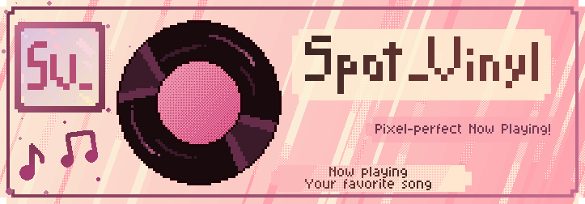
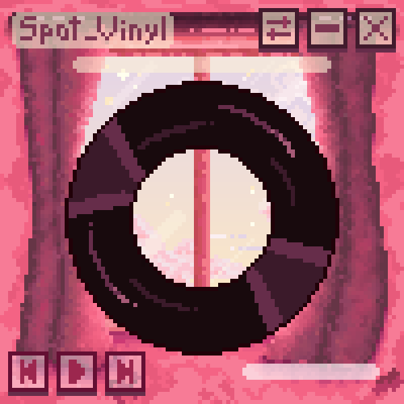
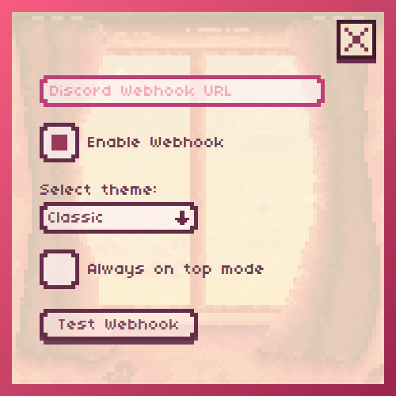
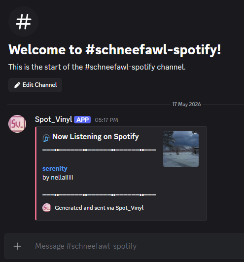
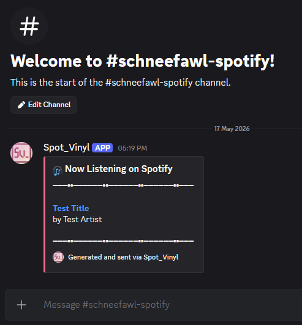

    
    
    

# 💿 About Spot_Vinyl

Spot_Vinyl is a minimalist, pixel-art desktop widget which brings a different aesthetic to your Windows workspace by displaying the current playin song.

Unlike other widgets, **Spot_Vinyl does not require a Spotify API**. It works by tapping directly into the **Windows Global System Media Transport Controls (GSMTC)** via **WinRT**. This means that it can listen to whatever Spotify is playing locally on your machine with zero configuration and zero privacy concerns regarding your Spotify account crredentials.

## 📸 Screenshots

|             Main menu              |               Settings Menu                |
| :--------------------------------: | :----------------------------------------: |
|  |  |

|             Discord embed              |               Discord test embed                |
| :------------------------------------: | :---------------------------------------------: |
|  |  |

## 📦 Installation

1. Head over to [Releases](https://github.com/SchneeFawl/Spot_Vinyl/releases/tag/v1.0) tab
2. Download the latest `Spot_Vinyl.exe`
3. Paste that executable in a newly created folder and run it!
   (No installation required, its a portable app)

## ✨ Features

- **Zero-config setup**: Works out of the box with Spotify for Windows
- **Pixel-art aesthetic**: Custom UI built from scratch using [Aseprite](https://github.com/aseprite/aseprite)
- **Discord Webhooks**: Automatically post your current song to a Discord channel with an embed which includes a link Spotify song link
- **Intelligent Debouncing**: Skips rapid track changes (5s delay) to prevent Discord webhook spam
- **Always on Top mode**: Keep the vinyl spinning above all your other apps
- **Lightweight**: Optimized to use minimal CPU and RAM (only 45MB)

## 🛠 Development Setup

If you want to run the source code or contribute:

- **Environment**: Windows 10/11 (required for WinRT/GSMTC integration)

## 🤝 Support

- **Bugs and Suggestions**: Found a bug or have an idea? Open an [Issue](https://github.com/SchneeFawl/Spot_Vinyl/issues)
- **Questions**: Want to show off your custom themes or ask a question? Join the [Discussions](https://github.com/SchneeFawl/Spot_Vinyl/discussions)

---

Created with ♥ by SchneeFawl
